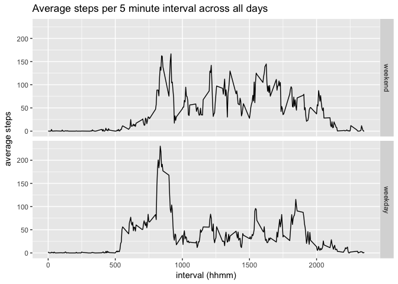

# Reproducible Research: Peer Assessment 1
## Loading and preprocessing the data

First we need to load the relevant packages

```r
library(dplyr)
library(lubridate)
library(ggplot2)
```

Then we need to read the data into R and convert to date format

```r
activity <- read.csv("activity.csv")
activity <- mutate(activity, date = ymd(date))
```

## What is the mean total number of steps taken per day?

The original data shows the number of steps taken per 5-minute interval. Using dplyr we can group by date and summarise the total number of steps taken per day.

```r
perday <- activity %>%
        group_by(date) %>%
        summarise(steps = sum(steps))
```

We can then calculate the mean and median number of steps per day.  
Note: missing days are removed when calculating the mean.

```r
mean <- mean(perday$steps, na.rm = TRUE)
median <- median(perday$steps, na.rm = TRUE)
options(scipen = 1)
```
The mean number of steps per day is **10766**  
The median number of steps per day is **10765**

We can also plot a histogram of the number of steps per day.

```r
scat <- ggplot(perday, aes(steps))
scat + geom_histogram(binwidth = 500) + coord_cartesian(ylim = c(0,11))
```

<!-- -->


## What is the average daily activity pattern?

The original data shows the number of steps taken per 5-minute interval. We can calculate the average steps per 5 minute interval across all days to show the typical daily pattern. To do this we first group by 5 minute interval, then we summarise the mean steps per interval.  
Note: missing values are removed when calculating the mean.


```r
perinterval <- activity %>%
        group_by(interval) %>%
        summarise(average_steps = mean(steps, na.rm = TRUE))
```

We can present this data in a time series. Intervals have the format: hhmm.

```r
g <- ggplot(perinterval, aes(interval, average_steps)) + 
        geom_line() + 
        ggtitle("Average steps per 5 minute interval across all days") +
        xlab("interval (hhmm)") +
        ylab("average steps")
g
```

<!-- -->

We can identify the maximum value in the above data by using filter() and max()

```r
maxinterval <- filter(perinterval, average_steps == max(average_steps))[,1]
max <- round(filter(perinterval, average_steps == max(average_steps))[,2])
```

The 5-minute interval with the maximum average number of steps is **835** which has **206** steps

## Imputing missing values

We can calculate the number of missing values

```r
n <- length(activity$steps)
missing <- sum(is.na(activity$steps))
```
Out of **17568** observations there are **2304** missing values

We can impute missing values using the per interval averages calculated above.  
To do this we create two new objects: a copy of the original data frame, and data frame consisting of repeated copies of the average day. We then replace the missing values in the copied data frame with the corresponding values in the repeated average day.

```r
activityest <- activity
perintervalrep <- perinterval[rep(seq(nrow(perinterval)), 61),]

for(i in 1:17568){
        if(is.na(activityest[(i),1])){
                activityest[(i),1] <- perintervalrep[[(i),2]]        
        }
}
```

We can now repeat the above analysis on the new data frame to calculate the total estimated steps per day.

```r
perdayest <- activityest %>%
        group_by(date) %>%
        summarise(steps = sum(steps))
```

We can then plot a new histogram of the estimated number of steps per day.

```r
scatest <- ggplot(perdayest, aes(steps))
scatest + geom_histogram(binwidth = 500)
```

<!-- -->

Notice the big bar in the centre with all the imputed values.

We can also calculate the new mean and median number of steps per day.

```r
meanest <- mean(perdayest$steps)
medianest <- median(perdayest$steps)
options(scipen = 1)
```
The new mean number of steps per day **10766**. It has not changed because we have imputed mean values.  
The median number of steps per day is **10766**. It has increased by just one step.

## Are there differences in activity patterns between weekdays and weekends?

To compare weekdays with weekends we first create a factor variable using wday() then recode.

```r
activityest2 <- activityest %>% 
        mutate(day = wday(activity$date, label = TRUE)) %>%
        mutate(day = recode(day, 
                            "Mon" = "weekday", 
                            "Tues" = "weekday", 
                            "Wed" = "weekday", 
                            "Thurs" = "weekday", 
                            "Fri" = "weekday", 
                            "Sat" = "weekend", 
                            "Sun" = "weekend"))
```

We can then group and summarise by interval and weekday

```r
perinterval2 <- activityest2 %>%
        group_by(interval, day) %>%
        summarise(average_steps = mean(steps))
```

Finally, we can create a panel of two time series plots showing the average number of steps per 5 minute interval across weekdays and weekends

```r
g <- ggplot(perinterval2, aes(interval, average_steps)) + 
        geom_line() + 
        facet_grid(day ~ .) +
        ggtitle("Average steps per 5 minute interval across all days") +
        xlab("interval (hhmm)") +
        ylab("average steps")
g
```

<!-- -->

This person is most active in the morning with little activity during the day, suggesting an office job. 
At weekends this person gets up in the morning at a similar time, they are more active in the afternoon and they go to bed at a similar time.

Thank you for reading!
